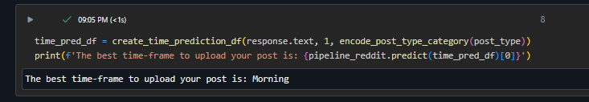

# LinkedIn Post Timing and Content Prediction

## 🌟 Overview

LinkedIn is a social network most commonly used for promoting and maintaining business connections and professional interests. When a user is looking for a new job opportunity or to network within their field, they need to generate interest in their profile by creating meaningful and engaging content. Our project creates a ‘PowerPost’ tool that optimizes the quality and timing of their content to allow for more engagement on their post and thus broaden its reach.

The research question driving our project is as follows: what are the factors that create engaging, popular posts, and how can we assist the everyday user in implementing them into their content?

Our tool receives input from the user regarding their LinkedIn profile and the post specifics and creates a post with the highest success potential. Additionally, it provides users with an optimal time to post, as well as a generated image or a prompt to generate an image that will accompany the post.

## 🚀 Features
### Best Time Prediction: 
The system predicts the optimal times for posting on LinkedIn based on historical engagement data. Users can input their content, and the system suggests the best times to maximize visibility and engagement.

### Content Generation: 
Utilizing natural language processing (NLP) techniques, the system generates post content tailored to the user's input. It ensures that the generated content is relevant, engaging, and likely to resonate with the target audience.

### Image Generation:
The tool can also generate images or provide prompts for users to create images to accompany their posts, enhancing visual appeal and engagement.

### Scoring Mechanism:
 The system employs a scoring mechanism to evaluate the generated post content. The score reflects the potential effectiveness of the post in terms of engagement and reach. 

## If you want to see the code or results without having to run it, head over to the htmls 📂, where you can download ready-run html files for your 👀 pleasure. 

## 📝 Usage
### Very Important: first, begin by downloading the reddit_all_scraped_dataset.csv and the Full Project Interface.ipynb
## Upload the data to the runtime environment of the notebook (save the path, you'll need it later)
## Now, you can follow the steps below, from here or within the code. Enjoy!

### Step 1:
Run the first 2 cells in the project.

### Step 2:
Enter your data into the widgets

### Step 3:
Run all cells from Functions & Imports including Gemini & LinkedIn Companies Model sections, until the Reddit Model section. Don't run Reddit model!

### Step 4:
Run the following cell:

Now, your post has been generated!

### Step 5:
Upload the reddit dataset, paste the path here and run the cell:

### Step 6:
Run the Reddit Model section (you can choose 'run all below' over there).

### Step 7:
Now, run the following cell and the best time to upload your post will display!

### Step 8:
Run Generate Image section

### Step 9:
If you initially chose to wait 30 minutes for image generation, go make yourself some food, it'll take a while. Otherwise, receive a prompt to generate it yourself.

### All done! 🎉 We hope you enjoyed 😃 and that your next post reaches the 🌕 and 🌠

## 🧠 Model Training
To predict the optimal time for posting, we utilized a separate model trained on the Reddit dataset. This decision was made due to the availability of valid timestamps in the Reddit dataset. We employed a 100-dimensional word2vec vector to embed the post titles and indexed the subreddit-based post category. The post score was also considered in building the model.

For predicting the time of day, we categorized time into 5 separate blocks, ranging from 'Morning' to 'Late Night'. We used a Random Forest Classifier to classify each post into the appropriate time category.

The content generation model for post text was trained using an API to Google’s Gemini LLM. After experimenting with various approaches to prompt engineering, we settled on a final prompt (see Appendix for details).

As for image generation, we found that there are no free image generation models with API access. Therefore, we utilized a Stable Diffusion model from HuggingFace. However, due to its time-consuming nature (approximately 30 minutes for generation), we provided users with the option to choose whether to wait for the image generation or to use a prompt for free image generation tools.

## 📊 Evaluation
User experience and the tool's value are as crucial as model performance. We sought feedback from ourselves, friends, and family members at each stage to ensure usefulness, interest, and convenience. This feedback led to insightful changes, such as adding a GUI interface for the final notebook to collect user data and allowing the option to skip the 30-minute image generation. We prioritized usability over marginal accuracy improvements in our evaluation process.

We evaluated regression models using R2 and RMSE, and our classification model using straightforward accuracy. Manual evaluation was necessary for the generative LLM response and the success of our feedback cycles due to the complexity of the task.

## 📈 Results

### Post-Success Prediction Models
In our analysis, the Random Forest model consistently outperformed the Linear Regression model for predicting post success. Specifically, the Random Forest model yielded higher R2 values and lower RMSE values compared to the Linear Regression model. However, we encountered challenges with the performance of the model on the profiles dataset, leading us to discontinue its use. This may be attributed to the inadequacy of follower count as a representative measure, despite our attempts to refine it.

### Post-Time Classification Model
Our post-time classification model achieved a classification accuracy of 0.58. Notably, the confusion matrix for each time category indicated strong performance, with the most commonly confused classes being adjacent times of day. From a general perspective, the optimal posting times for various categories were identified as follows:

Work: Noon
Science & Tech: Afternoon
Inspiration: Late Night
Education: Morning
General: Afternoon
